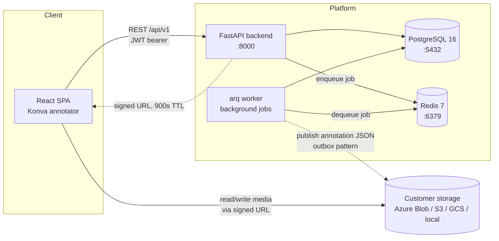

# Annotide

Cloud-agnostic annotation platform for images, video, audio, text and PDF
data. Teams bring their own object storage (Azure Blob, S3, GCS, or a local
mount) and their own AI model endpoints — the platform never copies raw
media into its own infrastructure. Annotators work through a browser-based
Konva canvas; the browser talks to blob storage directly via short-lived
signed URLs, so bulk media never round-trips through the API server.

## Architecture



- The API issues short-lived **signed URLs** (default 900s) so the browser
  reads/writes media directly against the customer's own storage — the
  backend never proxies large files.
- The **worker** (arq, Redis-backed; same image as the API, started as
  `arq app.worker.main.WorkerSettings`) runs source scans, snapshots and
  exports, plus a recurring **outbox publisher** that writes committed
  annotations to blob storage. Tiling and model pre-labelling jobs exist as
  job types but fail with "not implemented" until their platform side lands.
- All durable state (projects, items, tasks, annotation history, jobs)
  lives in **PostgreSQL**; **Redis** is the job queue only, not a source of
  truth.

See [`docs/CONTRACTS.md`](docs/CONTRACTS.md) for the full data model, REST
API, storage connector interface, and environment variable reference —
every service in this repo is built against that document.

## Prerequisites

- Docker + Docker Compose v2 (`docker compose version`)
- For local (non-container) development: Python 3.12 and Node.js 22

## Quick start

```sh
cp .env.example .env
make dev
```

This builds and starts postgres, redis, backend, worker and frontend, and
runs `alembic upgrade head` before the API starts serving. The stack runs as
the free Community edition (three users). To develop Business features, run
`make dev-licence` once first: it gives your local stack, and only it, a
throwaway Business licence (`.dev/`, gitignored).

| Service | URL | Notes |
| ------- | --- | ----- |
| Frontend | http://localhost:5173 | SPA, served by nginx; proxies `/api/` to the backend |
| Backend API | http://localhost:8000 | OpenAPI docs at `/docs`; health at `/api/v1/health` |
| Postgres | localhost:5432 | credentials from `.env` |
| Redis | localhost:6379 | job queue |

Stop the stack with `make down`; tail logs with `make logs`.

## Tests and linting

```sh
make test        # backend pytest (with coverage) + frontend vitest
make e2e         # Playwright against the running, seeded stack — see frontend/e2e/README.md
make loadtest    # k6 load test against the running, seeded stack — see loadtest/README.md
make mlflow      # local MLflow server on :5001 for the ML platform integration (API-6)
make emulators   # AWS (Moto) and GCS emulators + webhook echo receiver — see docs/LOCAL_CLOUDS.md
make integration # connector, secret and webhook tests against Azurite and the emulators
make lint         # ruff (backend) + eslint (frontend)
make typecheck    # mypy (backend) + tsc --noEmit (frontend)
make format       # ruff format (backend)
```

Backend commands use `backend/.venv/bin/...` when a local venv exists
(`make install` creates one), otherwise they fall back to running inside
the `backend` compose service — no local Python required either way.

CI (`.github/workflows/ci.yml`) runs the same checks on every push/PR, plus
a Trivy filesystem scan, a Python dependency audit, an SBOM export, and a
multi-image Docker build.

## Repo layout

| Path | Contents |
| ---- | -------- |
| `backend/` | FastAPI API — `app/{core,db,models,schemas,connectors,exporters,services,api}` |
| `frontend/` | React + TypeScript SPA (Vite, TanStack Query, Zustand, Konva) |
| `backend/app/worker/` | arq background worker — scan / snapshot / export jobs and the outbox publisher; runs from the backend image |
| `infra/compose/` | Local compose support files (Postgres init SQL) |
| `docs/CONTRACTS.md` | Single source of truth: data model, REST API, env vars, ports |
| `docker-compose.yml` | Local dev stack |
| `.github/workflows/` | CI: backend, frontend, security, docker |

## Documentation

| For | Read |
| --- | ---- |
| Installing it | [docs/INSTALL.md](docs/INSTALL.md) |
| Running it | [docs/OPERATIONS.md](docs/OPERATIONS.md), [docs/BACKUP.md](docs/BACKUP.md) |
| Using it | [docs/USER_GUIDE.md](docs/USER_GUIDE.md) |
| Security overview | [docs/SECURITY.md](docs/SECURITY.md) |
| Azure | [infra/terraform/azure/README.md](infra/terraform/azure/README.md), [docs/ENTRA.md](docs/ENTRA.md) |
| AWS | [infra/terraform/aws/README.md](infra/terraform/aws/README.md) |
| Google Cloud | [infra/terraform/gcp/README.md](infra/terraform/gcp/README.md) |
| Testing every cloud locally | [docs/LOCAL_CLOUDS.md](docs/LOCAL_CLOUDS.md) |
| Interfaces and data model | [docs/CONTRACTS.md](docs/CONTRACTS.md) |

## Configuration

All backend/worker settings are `APP_`-prefixed environment variables read
via `pydantic-settings`; the frontend uses Vite's `VITE_` prefix. The full,
authoritative list — with defaults and meanings — is in
[`docs/CONTRACTS.md`](docs/CONTRACTS.md#environment-variables-ops-1) and
mirrored with development defaults in [`.env.example`](.env.example).
Never commit a real `.env`.

## Current status

**Phase-1 MVP skeleton.** The containers, compose wiring, CI pipeline and
job scaffolding described above are in place; several application-level
pieces (API routers, models, connectors, the Konva editor) are landing in
parallel and may not be complete yet. "Definition of done" for this
skeleton is tracked in
[`docs/CONTRACTS.md`](docs/CONTRACTS.md#definition-of-done-for-the-skeleton).
