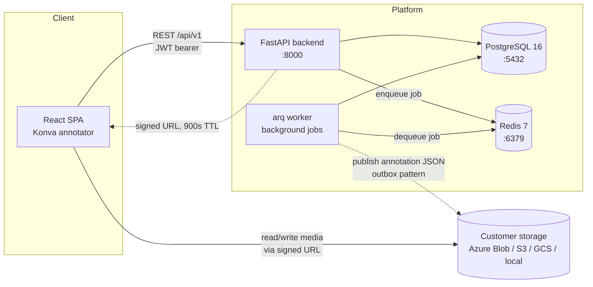

# Annotide

**Self-hosted data annotation and labeling platform** for images, video,
audio, text, PDF, time series and LLM evaluation: an alternative to CVAT,
Label Studio, Labelbox and V7 that keeps your data in your own cloud.
Annotide reads media straight from your Azure Blob Storage, Amazon S3,
Google Cloud Storage, Databricks volume or local disk through short-lived
signed URLs and stores only the annotations. Pre-label with your own models,
review and measure quality, and export to COCO, YOLO, spaCy and more.

[Website](https://annotide.com) ·
[Docs](https://annotide.com/docs/) ·
[Features](https://annotide.com/features/) ·
[Pricing](https://annotide.com/pricing/) ·
[Compare](https://annotide.com/compare/) ·
[Python SDK](https://pypi.org/project/annotide/)


## Install

```sh
curl -fsSL https://annotide.com/install.sh | sh
```

One command with Docker on your own machine; production on any Kubernetes
cluster with the Helm chart `oci://ghcr.io/annotide/charts/annotide`
([installation guide](docs/INSTALL.md)). The Community edition is free for up
to three users, commercial use included. Licence: [Elastic License 2.0](LICENSE.md)
(source-available); the Python SDK, CLI and MCP server are Apache-2.0.

## What it does

- **Annotation tools:** box, rotated box, polygon, polyline, point,
  keypoints, brush masks, superpixels and a smart polygon (interactive
  segmentation with your model); video tracks with interpolation; text
  spans and relations (NER); PDF with OCR; audio segments with speaker and
  transcript; time series; LLM evaluation (ranking, pairwise, ratings).
- **Quality control:** review queue, consensus, gold items, annotator
  agreement and accuracy.
- **Models and active learning:** pre-labelling with your own model
  endpoints, uncertainty-ordered queues, model lineage, retraining webhooks
  for MLflow, Databricks and Azure ML.
- **Data:** versioned snapshots, train / val / test splits, export to COCO,
  YOLO, YOLO-pose, spaCy, CoNLL and preference pairs; import from COCO,
  YOLO, VOC, CVAT and Label Studio.
- **Integrations:** Python SDK and CLI (`pip install annotide`), an MCP
  server for AI agents, webhooks, Slack and Microsoft Teams.
- **Enterprise basics without the enterprise tier:** OIDC single sign-on
  (Entra ID or any OIDC provider), SCIM, folder-level permissions and an
  audit log in the Business edition.

## How it works

Teams bring their own object storage and their own AI model endpoints; the
platform never copies raw media into its own infrastructure. Annotators work
through a browser-based Konva canvas; the browser talks to blob storage
directly via short-lived signed URLs, so bulk media never round-trips
through the API server.

### Architecture



- The API issues short-lived **signed URLs** (default 900s) so the browser
  reads/writes media directly against the customer's own storage — the
  backend never proxies large files.
- The **worker** (arq, Redis-backed; same image as the API, started as
  `arq app.worker.main.WorkerSettings`) runs source scans, snapshots and
  exports, plus a recurring **outbox publisher** that writes committed
  annotations to blob storage. Tiling and model pre-labelling jobs exist as
  job types but fail with "not implemented" until their platform side lands.
- All durable state (projects, items, tasks, annotation history, jobs)
  lives in **PostgreSQL**; **Redis** is the job queue only, not a source of
  truth.

See [`docs/CONTRACTS.md`](docs/CONTRACTS.md) for the full data model, REST
API, storage connector interface, and environment variable reference —
every service in this repo is built against that document.

## Prerequisites

- Docker + Docker Compose v2 (`docker compose version`)
- For local (non-container) development: Python 3.12 and Node.js 22

## Development quick start

```sh
cp .env.example .env
make dev
```

This builds and starts postgres, redis, backend, worker and frontend, and
runs `alembic upgrade head` before the API starts serving. The stack runs as
the free Community edition (three users). To develop Business features, run
`make dev-licence` once first: it gives your local stack, and only it, a
throwaway Business licence (`.dev/`, gitignored).

| Service | URL | Notes |
| ------- | --- | ----- |
| Frontend | http://localhost:5173 | SPA, served by nginx; proxies `/api/` to the backend |
| Backend API | http://localhost:8000 | OpenAPI docs at `/docs`; health at `/api/v1/health` |
| Postgres | localhost:5432 | credentials from `.env` |
| Redis | localhost:6379 | job queue |

Stop the stack with `make down`; tail logs with `make logs`.

## Tests and linting

```sh
make test        # backend pytest (with coverage) + frontend vitest
make e2e         # Playwright against the running, seeded stack — see frontend/e2e/README.md
make loadtest    # k6 load test against the running, seeded stack — see loadtest/README.md
make mlflow      # local MLflow server on :5001 for the ML platform integration (API-6)
make emulators   # AWS (Moto) and GCS emulators + webhook echo receiver — see docs/LOCAL_CLOUDS.md
make integration # connector, secret and webhook tests against Azurite and the emulators
make lint         # ruff (backend) + eslint (frontend)
make typecheck    # mypy (backend) + tsc --noEmit (frontend)
make format       # ruff format (backend)
```

Backend commands use `backend/.venv/bin/...` when a local venv exists
(`make install` creates one), otherwise they fall back to running inside
the `backend` compose service — no local Python required either way.

CI (`.github/workflows/ci.yml`) runs the same checks on every push/PR, plus
a Trivy filesystem scan, a Python dependency audit, an SBOM export, and a
multi-image Docker build.

## Repo layout

| Path | Contents |
| ---- | -------- |
| `backend/` | FastAPI API — `app/{core,db,models,schemas,connectors,exporters,services,api}` |
| `frontend/` | React + TypeScript SPA (Vite, TanStack Query, Zustand, Konva) |
| `backend/app/worker/` | arq background worker — scan / snapshot / export jobs and the outbox publisher; runs from the backend image |
| `infra/compose/` | Local compose support files (Postgres init SQL) |
| `docs/CONTRACTS.md` | Single source of truth: data model, REST API, env vars, ports |
| `docker-compose.yml` | Local dev stack |
| `.github/workflows/` | CI: backend, frontend, security, docker |

## Documentation

| For | Read |
| --- | ---- |
| Installing it | [docs/INSTALL.md](docs/INSTALL.md) |
| Running it | [docs/OPERATIONS.md](docs/OPERATIONS.md), [docs/BACKUP.md](docs/BACKUP.md) |
| Using it | [docs/USER_GUIDE.md](docs/USER_GUIDE.md) |
| Security overview | [docs/SECURITY.md](docs/SECURITY.md) |
| Azure | [infra/terraform/azure/README.md](infra/terraform/azure/README.md), [docs/ENTRA.md](docs/ENTRA.md) |
| AWS | [infra/terraform/aws/README.md](infra/terraform/aws/README.md) |
| Google Cloud | [infra/terraform/gcp/README.md](infra/terraform/gcp/README.md) |
| Testing every cloud locally | [docs/LOCAL_CLOUDS.md](docs/LOCAL_CLOUDS.md) |
| Interfaces and data model | [docs/CONTRACTS.md](docs/CONTRACTS.md) |

## Configuration

All backend/worker settings are `APP_`-prefixed environment variables read
via `pydantic-settings`; the frontend uses Vite's `VITE_` prefix. The full,
authoritative list — with defaults and meanings — is in
[`docs/CONTRACTS.md`](docs/CONTRACTS.md#environment-variables-ops-1) and
mirrored with development defaults in [`.env.example`](.env.example).
Never commit a real `.env`.

## Status

Released; see [releases](https://github.com/annotide/annotide/releases)
for versions and changes. Security reports: [SECURITY.md](SECURITY.md).
